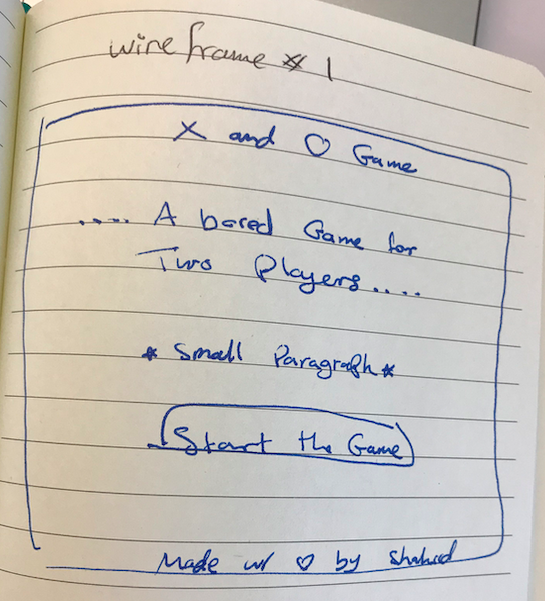
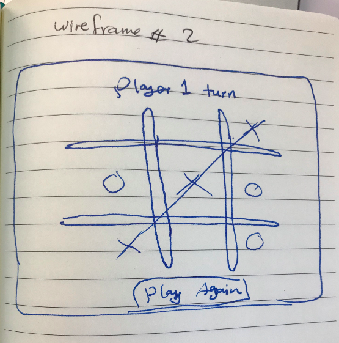

# Project X and O Game
A bored game for two players.
The player who succeeds in placing thier X or O in horizontal, vertical or diagonal line is the WINNER.

[Click Here to PLAY](https://shahadalalmai.github.io/tic-tac-toe/)


## My Project Deployment

## Technologies used in the project
Below is the list of technologies I used in developing this game.
* Github
* Git
* HTML
* CSS
* JavaScript
* JQuery

## wireframes and user stories.
#### Wireframes:
<!--  -->


<!--  -->

#### Uset Stories
* As a user, I should be able to start a new X and O game.
* As a user, I should be able to click on a square to add X first and then O, and so on.
* As a user, I should not be able to click the same square twice
* As a user, I should be shown a message when I win, lose or tie or whos turn is now.
* As a user, I should not be able to continue playing once I win, lose, or tie
* As a user, I should be able to play the game again without refreshing the page.

## Planning and Development Process
### Day 1
1. Sat a plan for the project.
2. Drew the wireframes.
3. Got inspired and selected the colors and font.
4. Finished up struchering my html and css.
5. Wrote my psudocode.
6. Added my JavaScrip and JQuery.
7. Created click event where I can place X and O in the boxes.

### Day 2
1. Continued writing the code logic where I counted the steps of the game.
2. Created conditions to check the winner after matching any of the winning possibilities.
3. Disabled the click event when the user finished the game either by winning, losing or none.

### Day 3
1. Created winning function where it changes some html elements text and css.
2. Created end game function where is shows a play again button to reset the game without refreshing the page.
3. Made the game responsive for mobile usage.
4. Added sounds for more interactive gaming.

### Day 4
1. Created README.md file.
2. Deployed my application to Github.


# Describe any lines or function in the code
```js
    function divClick(event) { 
        const content = event.target
    if (counter % 2 !== 0) { // if odd, put X
        $('audio#pop')[0].play()
        content.innerHTML = '<h1>X</h1>'
        steps++
        counter++ 
        $('#turn').text("2nd Player Turn")
    } else { // if even, put O
        $('audio#blop')[0].play()
        content.innerHTML = '<h1>O</h1>'
        steps++
        counter++
        $('#turn').text("1st Player Turn")
    }
    }
```
## Challenges
The game logic. Was not very clear at first, then thought of using arrays in storing user's choices, then felt it's a bit challenging and mind twisting. So, I thought of keeping it simple by comparing user's choices using if else conditions.

# Unsolved problems which would be fixed in future iterations
* Storing users' tokens.
* Set a timer for the game.
* Keeping rounds of the game.
* Crossing the winning boxes with animated line.

